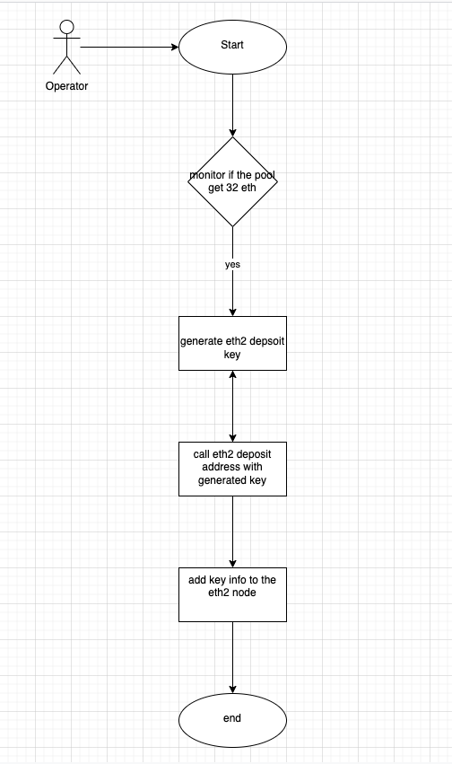

## Design the eth2 staking pool

### Concepts
- Make normal user easy onboarding for the eth2 staking and get rewards from it.
- Normal user doesn't have the ability to run the eth2 node
- eth2 staking requires 32 ETH, user who owners less than 32 eth but still want to get eth2 staking rewards.

### Solutions
we create the eth2 staking pool service for user, user doesn't need to care about the eth2 node and key management. we create a eth staking pool which let user deposit there eth to the pool and get share of the pool. once the pool reach 32 eth, we will process the staking service for user. we set the eth2 withdraw address to the pool itself, user can receive the eth2 staking rewards.

### smart contract functionality

- create staking pool for user
- collect user fund
- send 32 eth to eth staking contract once reach 32 eth. (using generated key)
- user can claim the staking rewards
- user be able to exit the pool or transfer the share to others.

### smart contract
- Overview
  
  
- User diagram
  
  
- Pool create flow chart
  
  
- User deposit

  
- Operator perform deposit
  
  
- eth rewards distribution
  
  

